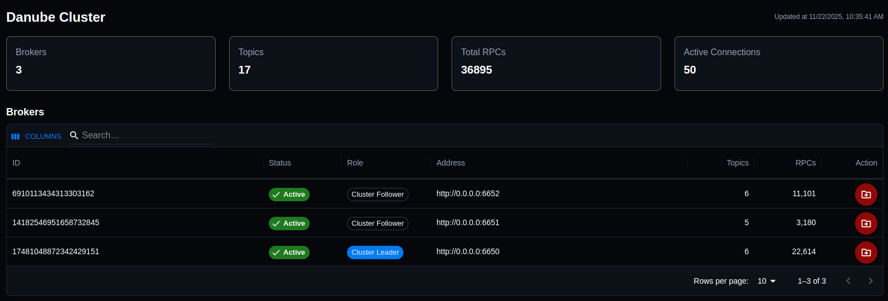
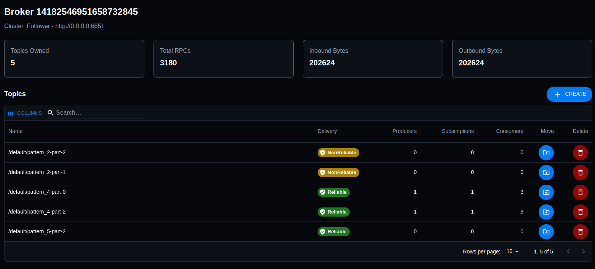
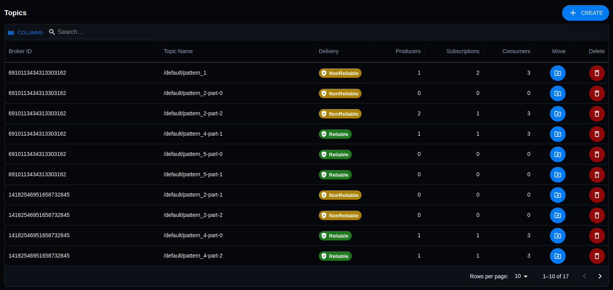

# Danube Admin UI

This repository contains the source code for the Danube Admin UI, a modern web interface for managing and monitoring a Danube messaging cluster. 

The UI is built with React, TypeScript, and MUI, and it communicates with the `danube-admin-gateway` backend service.

## Danube Admin UI Screenshots

**Cluster Listing**:

Overview of the cluster, shows all the brokers from the cluster.

Actions: 
* Unload broker, moves all topics to another available broker
* Activate a drained broker, in order to resume accepting new topics
* Click a broker row to open its details.




**Broker Details**:

Overview of the broker and the topics table associated with the broker.

Actions: 
* Create topic, creates a topic in the cluster 
* Move topic to another available broker, cluster leader selects the target broker
* Delete topic, removes the topic from the cluster
* Click a topic row to open its details.




**Topics**:

Overview of the topics in the cluster. The NonReliable and Reliable topic is a dispatch / persistence mode, see the [Danube dispatch strategy](https://danube-docs.dev-state.com/architecture/dispatch_strategy/) for more details.

Actions: 
* Create topic, creates a topic in the cluster 
* Move topic to another available broker, cluster leader selects the target broker
* Delete topic, removes the topic from the cluster
* Click a topic row to open its details.




## Running with Docker (Recommended)

Run the UI in a container with minimal steps. Host port matches docker-compose (5173).

```bash
docker build -t danube-admin-ui .
docker run -d --name danube-admin-ui -p 5173:80 danube-admin-ui
```

Open: http://localhost:5173

Note: The UI expects the gateway at http://localhost:8080 by default.

To stop/remove:

```bash
docker stop danube-admin-ui && docker rm danube-admin-ui
```

## Development

If you want to contribute to the development of the UI, you can set up a local development environment using docker-compose.

### Prerequisites

- [Docker](https://www.docker.com/get-started) must be installed and running on your system.
- [Docker Compose](https://docs.docker.com/compose/install/)

### Local Setup with Docker Compose

1.**Run the development environment:**
    This command will start the application and all the required services. The `--build` flag will build the images if they don't exist.

```bash
docker-compose up --build
```

2.**Stopping the development environment:**
    To stop the application and remove the containers, use the following command:

```bash
docker-compose down
```

The application will be available at **<http://localhost:5173>** and will automatically reload when you make changes to the code.


