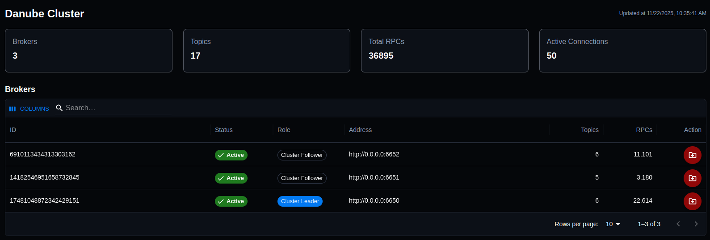
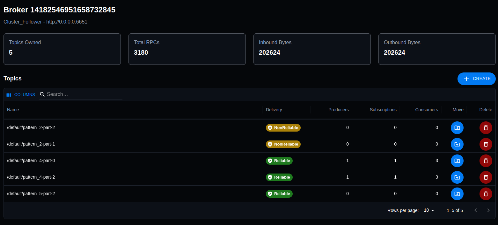
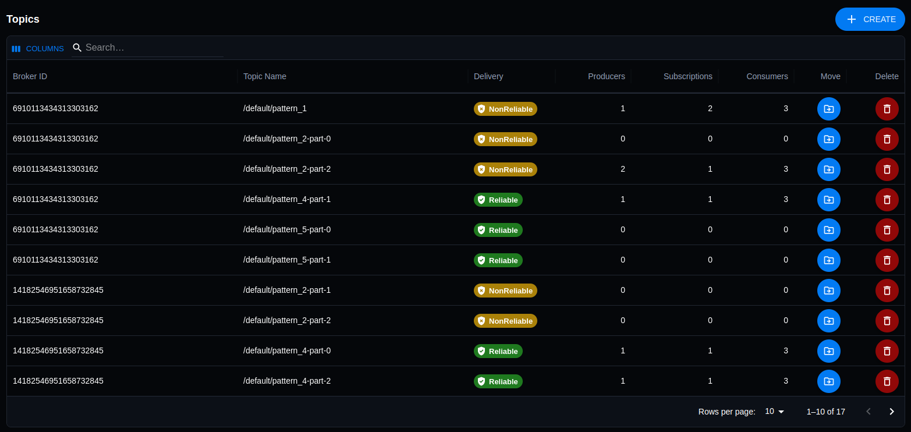

# Danube Admin UI

This repository contains the source code for the Danube Admin UI, a modern web interface for managing and monitoring a Danube messaging cluster. 

The UI is built with React, TypeScript, and MUI, and it communicates with the `danube-admin-gateway` backend service.

## Danube Admin UI Screenshots

**Cluster Listing**:

Overview of the cluster, shows all the brokers from the cluster.

Actions: 
* Unload broker, moves all topics to another available broker
* Activate a drained broker, in order to resume accepting new topics
* Click a broker row to open its details.




**Broker Details**:

Overview of the broker and the topics table associated with the broker.

Actions: 
* Create topic, creates a topic in the cluster 
* Move topic to another available broker, cluster leader selects the target broker
* Delete topic, removes the topic from the cluster
* Click a topic row to open its details.




**Topics**:

Overview of the topics in the cluster. The NonReliable and Reliable topic is a dispatch / persistence mode, see the [Danube dispatch strategy](https://danube-docs.dev-state.com/architecture/dispatch_strategy/) for more details.

Actions: 
* Create topic, creates a topic in the cluster 
* Move topic to another available broker, cluster leader selects the target broker
* Delete topic, removes the topic from the cluster
* Click a topic row to open its details.




## Running with Docker (Recommended)

Run the UI in a container with minimal steps. Host port matches docker-compose (5173).

```bash
docker build -t danube-admin-ui .
docker run -d --name danube-admin-ui -p 5173:80 danube-admin-ui
```

Open: http://localhost:5173

Note: The UI expects the gateway at http://localhost:8080 by default.

To stop/remove:

```bash
docker stop danube-admin-ui && docker rm danube-admin-ui
```

## Development

If you want to contribute to the development of the UI, you can set up a local development environment. 

### Prerequisites

- [Docker](https://www.docker.com/get-started) & [Docker Compose](https://docs.docker.com/compose/install/) (if using the Docker setup)
- [Rust](https://www.rust-lang.org/tools/install) (if running the backend locally via `make`)
- [Node.js](https://nodejs.org/) (for local UI host development)

### Local Setup with Make (Host Development)

If you are developing features across the entire stack, run the backend locally on your host machine via `make` targets.

1. **Start the backend services:**
   In the `danube` repository root:
   ```bash
   make brokers  # Compiles and starts 3 broker instances
   make prom     # Starts the Prometheus container on port 9090 (collects metrics)
   make admin    # Starts the HTTP admin server on port 8080
   ```

2. **Run the UI development server:**
   In the `danube-admin-ui` repository root:
   ```bash
   npm install   # Install dependencies
   npm run dev   # Starts the Vite dev server on http://localhost:5173
   ```

3. **Stop and clean up:**
   In the `danube` repository root:
   ```bash
   make admin-clean
   make brokers-clean
   make prom-clean
   ```

### Local Setup with Docker Compose

Running the development environment with Docker Compose spins up the complete prepackaged Danube backend stack (3 brokers, admin server, and Prometheus) from official images, while building and running your local `danube-admin-ui` source code inside a Node development container with hot-reloading.

1. **Prepare and run the development environment:**
   Navigate to the `docker/` directory, follow the steps in [docker/README.md](file:///home/danr/danube_stream/danube-admin-ui/docker/README.md) to download the config files, and start the services:
   ```bash
   cd docker
   docker-compose up --build
   ```

2. **Stop the development environment:**
   To stop the services and clean up containers and volumes:
   ```bash
   cd docker
   docker-compose down -v
   ```

The application will be available at **<http://localhost:5173>** and will automatically reload when you make changes to your local files.


