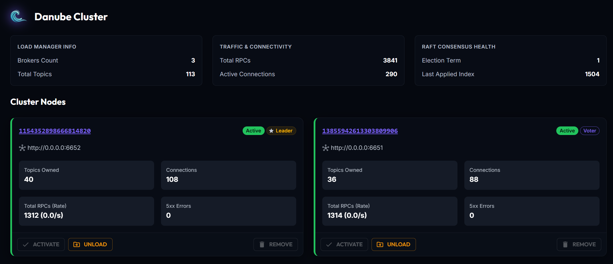
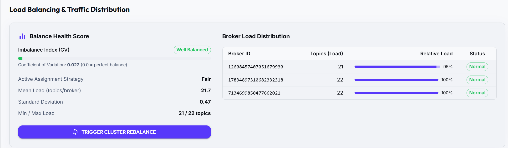
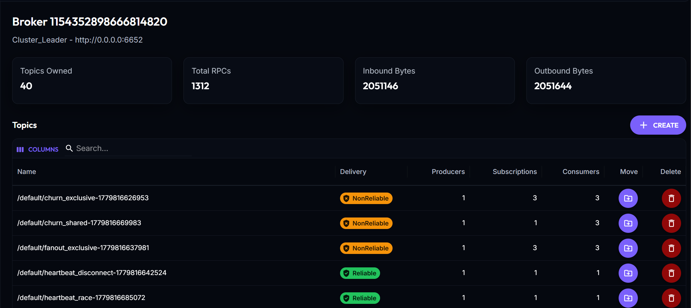
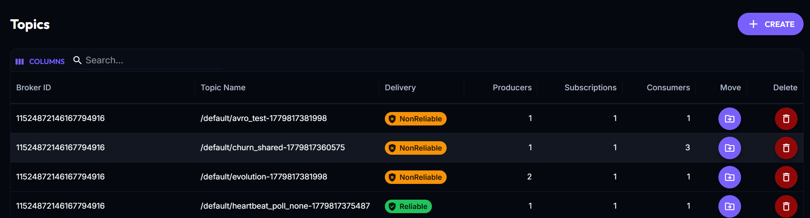
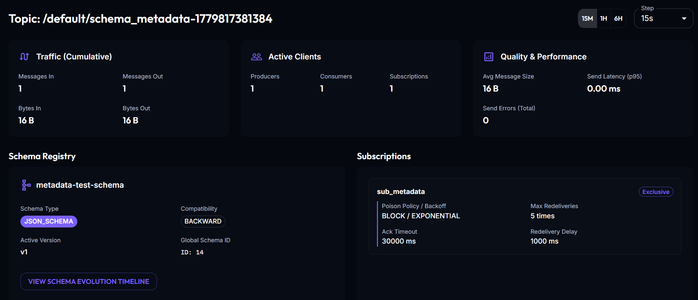
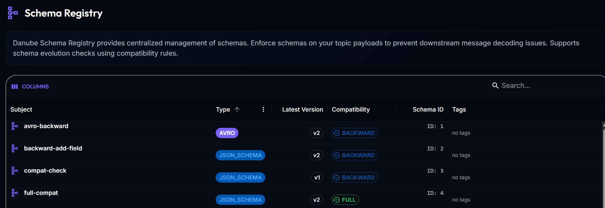

# Danube Admin UI

The **Danube Admin UI** is a modern, responsive web dashboard designed for cluster operators and developers. It provides full visibility into cluster state, namespace topology, topic metrics, schema registry configurations, and security policies.

## How It Works

The Admin UI is a single-page web application (built with React and Material UI) that runs entirely in your browser.

It communicates over REST/HTTP with the **Danube Admin Server**, a lightweight Rust backend (referred to as the BFF, or Backend-for-Frontend) that acts as a gateway between the UI and your cluster. The Admin Server translates HTTP requests into gRPC calls directed at the active cluster leader broker, and also queries Prometheus for real-time throughput metrics.

## Guided Tour

Here is a walkthrough of the main pages in the Danube Admin UI.

### Cluster Dashboard
The landing page is your operational command center. It is organized into three main areas:

**Cluster Info Panels**: Three summary cards at the top give you an instant snapshot of the cluster:
* **Load Manager Info**: Active broker count and total topic count across the cluster.
* **Traffic & Connectivity**: Aggregate RPC totals and the number of active client connections.
* **Raft Consensus Health**: The current election term and last applied log index, confirming that the consensus layer is healthy and converging.

**Cluster Nodes**: Each broker is displayed as a card showing its Raft role, status, and live stats. Operational actions like Activate, Unload, Promote, and Remove are available directly from each card.



**Load Balancing & Traffic Distribution**: Shows the cluster's balance health score, per-broker load distribution, and lets you trigger a cluster rebalance with an optional dry-run preview.



### Broker Details
Clicking on a broker card takes you to the broker detail page. Here you can see the full list of topics currently assigned to that broker, along with per-topic stats such as subscription counts and producer/consumer activity.



### Topics
The Topics page lists all topics across the cluster with key metadata at a glance: delivery type, active producer, subscriptions and consumers.



Clicking on a topic opens its detail page, where you can inspect traffic metrics, active producers and consumers, subscriptions, and the schema associated with the topic.



### Schema Registry
The Schema Registry page provides a browsable view of all registered schemas. You can inspect individual schema definitions, see which topics reference them, and review schema versions.



### Namespaces
The Namespaces page lists all active namespaces in the cluster. You can create new namespaces or inspect administrative properties, allowing you to segment your messaging resources by environment, team, or application.

### Security & RBAC
Manage access control policies for your messaging resources. You can configure custom roles with fine-grained permissions (e.g., `Produce`, `Consume`, `Lookup`) and bind them to users or service accounts at cluster, namespace, or topic scopes.

---

## Try It Out with Docker Compose

The easiest way to spin up Danube with the Admin Server and Web UI is using Docker Compose. The setup launches **3 Brokers (Raft Consensus)**, a **CLI tool container**, a **Prometheus instance**, the **Admin BFF Server**, and the **Web UI**.

1. **Create a local directory** for the configuration:
   ```bash
   mkdir danube-ui-demo && cd danube-ui-demo
   ```

2. **Download the required files** from the official GitHub repository:
   ```bash
   # Download Docker Compose setup
   wget https://raw.githubusercontent.com/danube-messaging/danube/main/docker/with-ui/docker-compose.yml

   # Download Broker configuration
   wget https://raw.githubusercontent.com/danube-messaging/danube/main/docker/danube_broker.yml

   # Download Prometheus configuration
   wget https://raw.githubusercontent.com/danube-messaging/danube/main/docker/prometheus.yml
   ```

3. **Start the services**:
   ```bash
   docker compose up -d
   ```

4. **Access the Dashboard**:
   Once the containers are running, open your browser:
   * **Admin UI**: [http://localhost:8081](http://localhost:8081)
   * **Prometheus UI**: [http://localhost:9090](http://localhost:9090)

5. **Stop and Clean Up**:
   ```bash
   docker compose down -v
   ```

---

## Development

If you want to contribute to the development of the UI, you can set up a local development environment. 

### Prerequisites

- [Docker](https://www.docker.com/get-started) & [Docker Compose](https://docs.docker.com/compose/install/) (if using the Docker setup)
- [Rust](https://www.rust-lang.org/tools/install) (if running the backend locally via `make`)
- [Node.js](https://nodejs.org/) (for local UI host development)

### Local Setup with Make (Host Development)

If you are developing features across the entire stack, run the backend locally on your host machine via `make` targets.

1. **Start the backend services:**
   In the `danube` repository root:
   ```bash
   make brokers  # Compiles and starts 3 broker instances
   make prom     # Starts the Prometheus container on port 9090 (collects metrics)
   make admin    # Starts the HTTP admin server on port 8080
   ```

2. **Run the UI development server:**
   In the `danube-admin-ui` repository root:
   ```bash
   npm install   # Install dependencies
   npm run dev   # Starts the Vite dev server on http://localhost:5173
   ```

3. **Stop and clean up:**
   In the `danube` repository root:
   ```bash
   make admin-clean
   make brokers-clean
   make prom-clean
   ```

### Local Setup with Docker Compose

Running the development environment with Docker Compose spins up the complete prepackaged Danube backend stack (3 brokers, admin server, and Prometheus) from official images, while building and running your local `danube-admin-ui` source code inside a Node development container with hot-reloading.

1. **Prepare and run the development environment:**
   Navigate to the `docker/` directory, follow the steps in [docker/README.md](docker/README.md) to download the config files, and start the services:
   ```bash
   cd docker
   docker-compose up --build
   ```

2. **Stop the development environment:**
   To stop the services and clean up containers and volumes:
   ```bash
   cd docker
   docker-compose down -v
   ```

The application will be available at **http://localhost:5173** and will automatically reload when you make changes to your local files.
